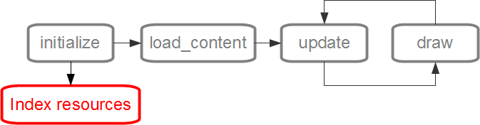

==================
Managing Resources
==================

Basically, we can define resources as any file other than the code, e.g. images, fonts and music. To use these resources on the Batma is necessary to specify the directories where they are, no files outside the resource directories can be loaded into the game.

For small projects a single directory for all resources can solve all problems, but with bigger games or applications is more interesting to divide it into sub-directories, for example ``resources/sprites``, ``resources/sounds``, ``resources/sources``, etc.

The registry of resource directories must be done into the ``initialize`` method, so their content can be indexed before the use (as you can see in the image above). This registry is done with :py:func:`batma.resource.add_resource_path` function::

    def initialize(self):
        # Adding one-by-one
        add_resource_path('resources')
        add_resource_path('resources/images')
        add_resource_path('resources/fonts')
        add_resource_path('resources/sounds')
        add_resource_path('resources/whatever')

        # Adding in one-shot:
        add_resource_patch('resources', 'resources/images', 'resources/fonts')

--------------------
Supported file types
--------------------

======= ==================
 Media   Supported types
======= ==================
Images  bmp, dds, exif, gif, jpg, jpeg, jp2, jpx, pcx, png, pnm, ras, tga, tif, tiff, xbm, xpm
Audio   au, mp2, mp3, ogg/vorbis, wav, wma
Videos  avi, divX, h.263, h.264, mpeg, mpeg-2, ogg/theora, xvid, wmv
Fonts   ttf (TrueType e OpenType, pfm, pfb, fnt, dfont, pcf, bdf, sfont, pfr
======= ==================

