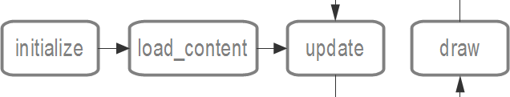

==========
Introdução
==========

O **Batma** é um framework para criação de jogos e aplicações gráficas 2D, construído em cima do framework `Pyglet`_ e inspirado no funcionamento do `XNA`_ e `Cocos2d`_. O Batma tem a vantagem de possuir todos recursos disponíveis na Pyglet com um fluxo de dados simples e intuitivo herdado do XNA somado a toda diversão do Python.

Algumas características do Batma:

* Manipulação simples e fácil de **sprites**, incluindo **sprites animados**;
* Simples interface para utilização de **textos**;
* Manipulação de alto nível para **desenhar primitivas** como linhas, retângulos ou círculos;
* Organização hierárquica dos elementos da tela;
* Use, modifique e distribua, todo código está sob a **Licença MIT**;

---------------
O fluxo do jogo
---------------

O fluxo de um jogo feito com o Batma pode ser dividido basicamente em 4 passos:

**initialize**
   É o primeiro método executado quando um jogo é iniciado, é onde você pode fazer todas as inicializações que não precisam de recursos gráficos. A definição dos diretórios de recursos deve ser feita aqui (veja :doc:`resources`). Esse método é chamado apenas uma vez e no começo do jogo.

**load_content**
    Esse método é executado logo depois do ``initialize``, também é chamado apenas uma vez e no começo do jogo. Aqui você pode carregar todo conteúdo gráfico, como imagens, fontes e sons. Antes de tentar carregar qualquer arquivo você deve ler :doc:`resources`.

**update**
    Esse é o método usado para atualizar o estado do jogo, por exemplo atualizar contadores, verificar pontuações, verificar eventos do teclado e mouse, mover os objetos, etc. 

**draw**
    Aqui fica todas as chamadas de funções e métodos para desenhar na tela. Note que este método e o ``update`` são chamados repetidamente até o final do jogo.

Nas próximas seções você verá na prática como esse fluxo funciona.

.. _`Pyglet`: http://pyglet.org
.. _`XNA`: http://create.msdn.com
.. _`Cocos2d`: http://cocos2d.org