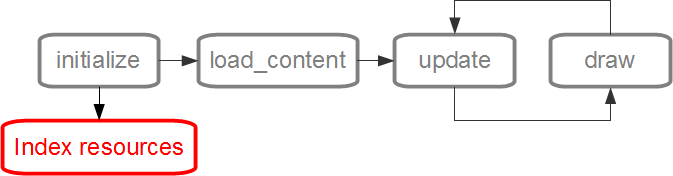

=======================
Gerenciando os recursos
=======================

Basicamente, podemos definir os recursos como qualquer arquivo que não seja o código, por exemplo imagens, fontes e músicas. Para usar esses recursos no Batma é necessário especificar os diretórios onde eles se encontram. Nenhum arquivo fora dos diretórios de recursos pode ser carregado no jogo.

Para projetos pequenos apenas um diretório para todos os recursos pode resolver mas com jogos ou aplicações maiores é interessante dividir em sub-diretórios, por exemplo ``resources/sprites``, ``resources/sons``, ``resources/fontes`` entre outros.

O registro dos diretórios de recursos deve ser feito no método ``initialize`` para que o conteúdo deles seja indexado antes de seu uso (como pode ser observado na imagem acima). Isso é feito utilizando usado a função :py:func:`batma.resource.add_resource_path`::

    def initialize(self):
        # Adicionando um por um
        add_resource_path('resources')
        add_resource_path('resources/imagens')
        add_resource_path('resources/fontes')
        add_resource_path('resources/sons')
        add_resource_path('resources/whatever')

        # Ou adicionando tudo de uma vez:
        add_resource_patch('resources', 'resources/imagens', 'resources/fontes')

----------------------------
Tipos de arquivos suportados
----------------------------

======= ==================
 Media   Tipos suportados
======= ==================
Imagens bmp, dds, exif, gif, jpg, jpeg, jp2, jpx, pcx, png, pnm, ras, tga, tif, tiff, xbm, xpm
Audio   au, mp2, mp3, ogg/vorbis, wav, wma
Videos  avi, divX, h.263, h.264, mpeg, mpeg-2, ogg/theora, xvid, wmv
Fontes  ttf (TrueType e OpenType, pfm, pfb, fnt, dfont, pcf, bdf, sfont, pfr
======= ==================

